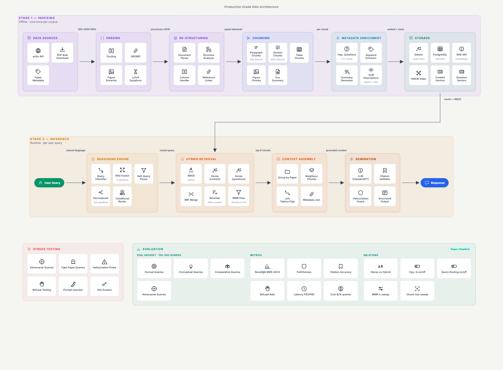

# Production Ready Agentic RAG System

Production-grade RAG over arXiv papers. Two-stage pipeline: offline indexing, runtime inference. Evaluated continuously, stress-tested for failure modes.

## Architecture

<p align="center">
  
</p>

## Process
### Ingestion
Either ingesting selected documents then:
```
uv run python -m src.ingestion.cli -i data/a.pdf data/b.pdf
```
For entire folder of documents
```
uv run python -m src.ingestion.cli -b data/
```

Running ingestion the first time will take a bit more time than subsequent runs even for the same data, as docling will download its model for the first time.

On Windows, if ingestion fails with a `torch` / `c10.dll` load error, install the Microsoft Visual C++ Redistributable:
https://aka.ms/vs/17/release/vc_redist.x64.exe

## Run Git Hooks Manually

Run the same checks that execute before commit:

```powershell
uv run --locked pre-commit run --all-files --hook-stage pre-commit
```

Run the same checks that execute before push:

```powershell
uv run --locked pre-commit run --all-files --hook-stage pre-push
```
